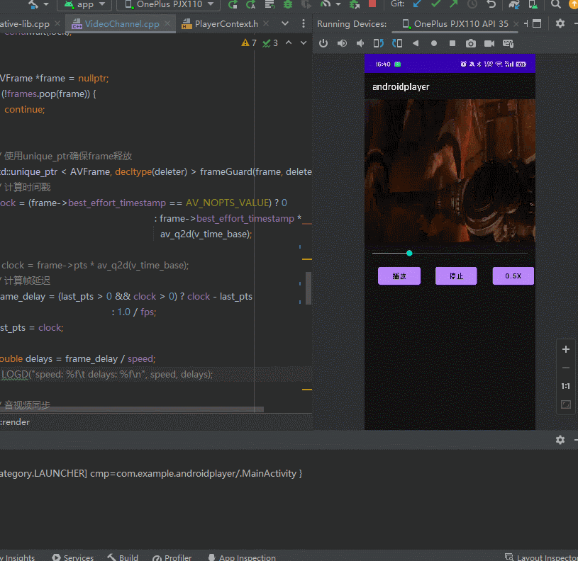

# Day 14： TASK2


- [x] 已全部完成
## 今日功能特点
- [x]  JNI接口: 实现播放，暂停， 结束，倍速，停止， 精准Seek，获取进度条。
- [x]  使用PlayerContext实现：解复用线程，解码线程、渲染线程间元数据通讯。
- [x]  通过条件变量实现暂时时阻塞渲染线程，再次播放时发送notify通知接触渲染阻塞。
- [x]  通过记录渲染帧pts，计算播放进度；通过将播放延迟除以速度实现控制播放速度。
- [x]  支持停止时优雅回收所有分配资源，防止内存泄露。
- [x]  使用单例，动态线程池机制管理多线程，切换播放源时可复用原有线程。
- [x]  利用无锁化队列优化线程池任务消费，支持较高的并发执行。
- [x]  实现声音播放，并实现音频同步：视频同步音频。
- [x]  实现精准seek机制，支持进度条前后随机拖动。

## 工程结构
```shell
├─3rd_party # 三方库目录
│  ├─ffmpeg
│  └─soundtouch
├─include # 头文件目录
└───ANWRender.h
└───AudioChannel.h
└───BaseChannel.h # 基础通道类
└───Clock.h # 时钟记录类
└───Constant.h
└───Convert.h
└───EGLRender.h
└───LockFreeQueue.h
└───Log.h # 日志声明类
└───Player.h
└───PlayerContext.h
└───Queue.h
└───RingQueue.h # 环形队列缓冲区
└───ThreadPool.h
└─src    # 源文件目录
└───AAudioRender.cpp # 音频回调处理类
└───ANWRender.cpp # Native窗口渲染类
└───AudioChannel.cpp #音频解码，回调重采样类
└───Convert.cpp # 视频转YUV类
└───Demuxer.cpp # 解复用器函数
└───EGLRender.cpp # EGL渲染类
└───LockFreeQueue.cpp # 无锁化队列类
└───Player.cpp # 视频播放控制类
└───Queue.cpp # 无解线程安全队列
└───ThreadPool.cpp # 动态线程池类
└───VideoChannel.cpp # 视频解码类
└───VideoRender.cpp # 视频渲染函数
└───native_lib.cpp # JNI接口实现函数
```

### JNI接口: 实现播放，暂停， 结束，倍速，音频同步，精准Seek，获取进度条。
---------------
播放：当用户点击播放按钮时，调用JNI接口实现视频，音频同步播放。：
  1. 全局初始化EGL渲染类，全局线程池类，使用单例模式。
  2. 进行Player初始化，读取数据源头信息，定位视频流和音频流，尝试获取硬件解码上下文。并初始化视频处理类和音频处理类。以及初始化一个PlayerContext类用于多线程共享元数据。
  3. 初始化视频类会为其创建packages队列和frames队列，为音频类创建packages队列和环形frames队列。
  4. 调用player->start()。分别启动音频解码线程，音频渲染线程；视频解码线程，视频渲染线程。最后启动解复用线程。
  5. 开始进入各自线程循环直到结束。
---------------
暂停：当用户点击暂停按钮时，调用JNI接口实现暂停播放。：
 1. player->pause()分别调用音频解码线程和视频解码线程的pause()方法。
 2. 各自线程中设置isPause为true，使用条件变量阻塞渲染线程循环。
---------------
继续：当用户点击继续按钮时，调用JNI接口实现继续播放。：
1. player->resume()分别调用音频解码线程和视频解码线程的resume()方法。
2. 各自线程z处isPause为false，使用条件变量的notify()方法解除阻塞渲染线程循环。
---------------
倍速：当用户点击倍速按钮时，调用JNI接口实现倍速播放。：
1. player->setSpeed()将分别调用音频和视频渲染线程的setSpeed()方法。
2. 音频线程通过设置soundtouch->setTempo(speed)并清除缓冲区。改变音频回调函数的回调时间。
3. 视频通过缩短帧的显示延迟实现倍速播放。
---------------
音频同步：视频同步音频
1. 在音频回调函数的周期调用中，同步音频显示的PTS时间到PlayerContext中。
2. 视频渲染帧前，计算当前PTS时间。并减去音频PTS时间，如果大于0，则等待音频PTS时间，最大等待一个时间基。如果小于0，则丢弃一帧。
---------------
基础Seek机制：当用户点击进度条时，调用JNI接口实现Seek。
1. 当进度条点击时，传递位置百分比给player。
2. PlayerContext根据百分比乘以总视频长度得到绝对位置，通过与最后进度条位置计算相对位置。用相对位置计算跳转容忍度。
3. 设置共享变量playerContext->seek_req=true。
4. 解复用线程首先读取到see_req, 通过调用avformat_seek_file实现视频流的跳转。
5. 然后，还需要清除视频packages和音频packages。
6. 清除完毕后，使用特殊的`通知AVFrame`借助packages队列通知解码线程，让解码线程进入seek状态。
7. 解码线程也会重新初始化解码器并清除frames队列。
8. 解复用线程seek完就能直接退出seek状态，无需等待解码线程退出seek状态。

> 优化：
> 1. 考虑到存在java线程持续读取进度条，在seek未处理完前可能存在进度条回拨。因此需要使用锁和条件变量阻塞java线程。
> 2. 与此同时，解复用线程未退出seek状态时，也要阻塞seek再此触发，以及获取进度条。
> 3. 进度条按下时先暂停播放，当进度条抬起时，再进行seek：避免频繁seek。
---------------
精准seek：当向后跳转时，可能会跳转到绝对PTS后面的关键帧（当设置了AVSEEK_FLAG_BACKWARD时）
1. 用户点击进度条时，计算出绝对位置PTS。
2. 将该PTS绝对位置存储到`通知AVFrame`中。
3. 解码线程结束seek状态后，再此读取到帧的PTS如果小于`通知AVFrame`的PTS则丢弃。
----------
获取进度条：当用户点击进度条时，调用JNI接口实现获取进度条。

1. 音频回调函数周期的调用 playerContext->setClock同步当前PTS时间到PlayerContext中。
2. 通过将当前PTS时间除以总视频长度得到百分比，传递给java层。
---------
停止：当用户点击停止按钮时，调用JNI接口实现停止播放。
1. player->stop()分别调用音频解码线程和视频解码线程的stop()方法。
2. 设置各自线程进入stop状态，并在退出时清理各自的队列。
3. 清理全局清除渲染器。
4. 终止全局线程池。等待每个线程退出。
-------------------
## 效果展示

### 播放：此处有GIF，稍等几秒🙂

### 暂停：此处有GIF，稍等几秒🙂

### 倍速：此处有GIF，稍等几秒🙂

### 精准seek：此处有GIF，稍等几秒🙂

### 音频同步：选择真机录制视频和声音
<video controls src="./.assets/音频同步.mp4" title="Title"></video>